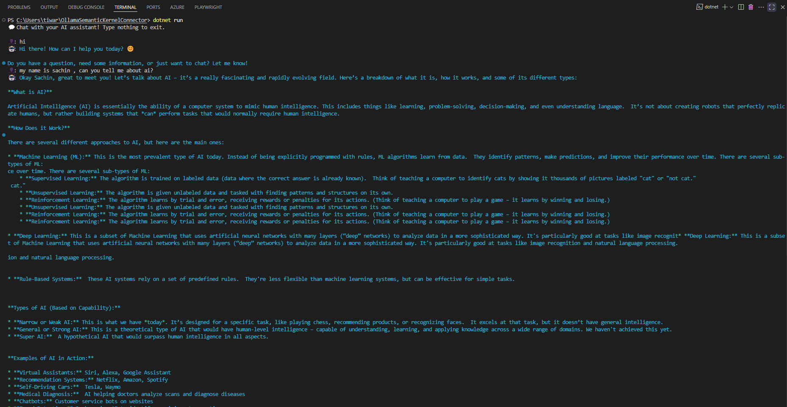

# Semantic Kernel Chat with Ollama

This is a simple console-based chat application using **Microsoft Semantic Kernel** and **Ollama** as the LLM backend. It demonstrates how to build a conversational assistant that remembers chat history and interacts in real-time.

---

## Features

- Connects to an Ollama chat model (`Gemma3:4b`) running locally.
- Maintains chat history with system and user messages.
- Real-time console chat interface.
- Friendly console UI with colored bot responses.
- Easy to extend for custom prompts or multiple assistants.

---

## Prerequisites

- [.NET 8 SDK](https://dotnet.microsoft.com/en-us/download/dotnet/8.0)
- Ollama server running locally (default: `http://localhost:11434`)
- Installed NuGet packages:
  - `Microsoft.SemanticKernel`
  - `Microsoft.SemanticKernel.ChatCompletion`

---

## Getting Started

1. **Clone the repository**  

```bash
git clone <your-repo-url>
cd <repo-folder>
````

2. **Restore packages**

```bash
dotnet restore
```

3. **Run the application**

```bash
dotnet run
```

4. **Chat**

   * Type your message and hit Enter.
   * The bot will respond in real-time.
   * Press Enter on an empty line to exit the chat.

---

## Example

```text
💬 Chat with your AI assistant! Type nothing to exit.

You: Hello, who are you?
Bot: I am your helpful assistant, here to answer your questions.

You: Can you tell me a fun fact?
Bot: Sure! Did you know that honey never spoils? Archaeologists have found pots of honey in ancient Egyptian tombs that are over 3000 years old and still perfectly edible.
```

---

## Chat


---

## Code Structure

* `Program.cs` — Main console app with chat logic.
* Chat history is maintained using `ChatHistory`.
* AI responses are fetched via `IChatCompletionService`.

---

## Notes

* Make sure the Ollama server is running and accessible at the provided URI.
* You can change the model by updating `"Gemma3:4b"` in `Program.cs`.
* The app is designed to be simple, extendable, and production-safe (no logic changes).

---

## Author

**Sachin**

---

## License

MIT License © Sachin
